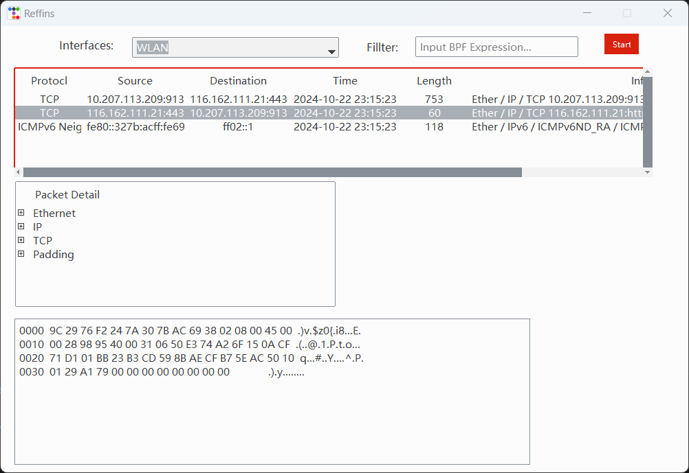

### Reffins
A network sniffer based on python scapy and has a UI interface. It uses an MVC-like architecture and can capture and identify the traffic flowing through the specified network adapter.

### Install
Install Dependencies

`pip install -r requirements.txt`
### Run

`python main.py`

### Snapshot

### References
[tkinter布局助手](https://www.pytk.net/)

[StevenBaby/sniffer](https://github.com/StevenBaby/sniffer)